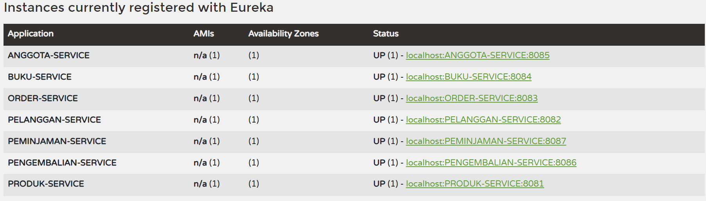

# Arsitektur Berbasis Layanan

## 📋 Eureka Service


## 🏗️ Arsitektur

- **Pola Arsitektur:** Microservices
- **Service Discovery:** Netflix Eureka sebagai pusat registrasi dan penemuan layanan
- **Komunikasi Antar Service:** RestTemplate dengan anotasi `@LoadBalanced` untuk load balancing otomatis
- **Gateway/Aggregator:** Setiap domain memiliki satu service aggregator untuk menyediakan data gabungan
- **Database:** H2 In-Memory Database untuk setiap service (untuk keperluan development dan testing)

## 🛠️ Teknologi yang Digunakan

| Komponen | Versi/Detail |
|----------|--------------|
| **Bahasa Pemrograman** | Java 17 |
| **Framework** | Spring Boot 3.5.5 |
| **Cloud Framework** | Spring Cloud 2025.0.0 |
| **Build Tool** | Apache Maven |
| **Database** | H2 In-Memory Database |
| **Service Discovery** | Netflix Eureka |

## 📊 Detail Service

| Domain | Nama Service | Port | Peran | Endpoint Utama |
|--------|--------------|------|-------|----------------|
| **Infrastruktur** | `EUREKA-SERVER` | `8761` | Service Registry | `http://localhost:8761` |
| **Marketplace** | `PRODUK-SERVICE` | `8081` | Service Mandiri | `http://localhost:8081/api/products/{id}` |
| **Marketplace** | `PELANGGAN-SERVICE` | `8082` | Service Mandiri | `http://localhost:8082/api/pelanggan/{id}` |
| **Marketplace** | `ORDER-SERVICE` | `8083` | Gateway/Aggregator | `http://localhost:8083/api/order/detail/{id}` |
| **Perpustakaan** | `BUKU-SERVICE` | `8084` | Service Mandiri | `http://localhost:8084/api/buku/{id}` |
| **Perpustakaan** | `ANGGOTA-SERVICE` | `8085` | Service Mandiri | `http://localhost:8085/api/anggota/{id}` |
| **Perpustakaan** | `PENGEMBALIAN-SERVICE` | `8086` | Service Mandiri | `http://localhost:8086/api/pengembalian/{id}` |
| **Perpustakaan** | `PEMINJAMAN-SERVICE` | `8087` | Gateway/Aggregator | `http://localhost:8087/api/peminjaman/detail/{id}` |

## 🚀 Cara Menjalankan Proyek

### 1. Prasyarat

Pastikan sistem Anda memiliki:
- **Java JDK 17** atau versi yang lebih tinggi
- **Apache Maven** (atau gunakan Maven Wrapper yang disediakan)
- **Git** untuk clone repository

### 2. Build Semua Service

Sebelum menjalankan aplikasi, lakukan build untuk semua service terlebih dahulu:

```bash
# Navigate ke direktori setiap service dan jalankan:
mvnw clean install
```

Perintah ini akan memastikan semua dependensi terunduh dengan benar dan aplikasi siap dijalankan.

### 3. Urutan Menjalankan Aplikasi

**⚠️ Penting:** Ikuti urutan berikut untuk memastikan semua service dapat berjalan dengan baik:

#### a. Jalankan Eureka Server (PERTAMA)
```bash
cd /path/to/eureka-server
mvnw spring-boot:run
```

#### b. Jalankan Service Mandiri (KEDUA)
Jalankan service-service berikut dalam urutan bebas:

```bash
# PRODUK-SERVICE
cd /path/to/Marketplace/Produk
mvnw spring-boot:run

# PELANGGAN-SERVICE
cd /path/to/Marketplace/Pelanggan
mvnw spring-boot:run

# BUKU-SERVICE
cd /path/to/Perpustakaan/Buku
mvnw spring-boot:run

# ANGGOTA-SERVICE
cd /path/to/Perpustakaan/Anggota
mvnw spring-boot:run

# PENGEMBALIAN-SERVICE
cd /path/to/Perpustakaan/Pengembalian
mvnw spring-boot:run
```

#### c. Jalankan Gateway/Aggregator Service (TERAKHIR)
```bash
# ORDER-SERVICE
cd /path/to/Marketplace/Order
mvnw spring-boot:run

# PEMINJAMAN-SERVICE
cd /path/to/Perpustakaan/Peminjaman
mvnw spring-boot:run
```

### 4. Verifikasi Service Discovery

Setelah semua service berjalan, kunjungi Eureka Dashboard di:
```
http://localhost:8761
```

Anda should melihat semua service terdaftar dengan status "UP".

## 🔗 Contoh Penggunaan API

### Marketplace - Order Detail

Untuk mendapatkan detail pesanan lengkap beserta informasi produk dan pelanggan:

```bash
curl -X GET http://localhost:8083/api/order/detail/1
```

**Response Example:**
```json
{
  "orderId": 1,
  "orderDate": "2024-01-15",
  "status": "COMPLETED",
  "pelanggan": {
    "id": 1,
    "nama": "John Doe",
    "email": "john@example.com"
  },
  "produk": {
    "id": 1,
    "nama": "Laptop Gaming",
    "harga": 15000000
  },
  "totalHarga": 15000000
}
```

### Perpustakaan - Peminjaman Detail

Untuk mendapatkan detail peminjaman lengkap beserta informasi buku, anggota, dan status pengembalian:

```bash
curl -X GET http://localhost:8087/api/peminjaman/detail/1
```

**Response Example:**
```json
{
  "peminjamanId": 1,
  "tanggalPinjam": "2024-01-10",
  "tanggalKembali": "2024-01-24",
  "status": "DIPINJAM",
  "anggota": {
    "id": 1,
    "nama": "Jane Smith",
    "nomorAnggota": "A001"
  },
  "buku": {
    "id": 1,
    "judul": "Pemrograman Java",
    "pengarang": "Budi Santoso"
  },
  "pengembalian": {
    "status": "BELUM_DIKEMBALIKAN",
    "denda": 0
  }
}
```

## 🛡️ Health Check

Setiap service memiliki endpoint actuator untuk monitoring:

```bash
# Contoh health check untuk BUKU-SERVICE
curl http://localhost:8084/actuator/health
```

## 🧪 Testing

Untuk menjalankan unit test pada semua service:

```bash
# Di direktori root setiap service
mvnw test
```

## 📝 Catatan Pengembangan

1. **Database H2 Console**: Setiap service memiliki H2 console yang dapat diakses di `http://localhost:{port}/h2-console`
2. **Load Balancing**: RestTemplate menggunakan `@LoadBalanced` untuk distribusi request otomatis
3. **Service Discovery**: Semua service menggunakan nama service yang terdaftar di Eureka untuk komunikasi internal
4. **Port Management**: Pastikan tidak ada konflik port dengan aplikasi lain yang berjalan

## 🤝 Kontribusi

Untuk berkontribusi pada proyek ini:

1. Fork repository
2. Buat feature branch (`git checkout -b feature/AmazingFeature`)
3. Commit changes (`git commit -m 'Add some AmazingFeature'`)
4. Push to branch (`git push origin feature/AmazingFeature`)
5. Buat Pull Request

## 📄 Lisensi

Proyek ini menggunakan lisensi [MIT License](LICENSE).

## 📞 Dukungan

Jika Anda mengalami masalah atau memiliki pertanyaan:

- Buka issue di GitHub repository
- Periksa dokumentasi Spring Cloud Netflix
- Konsultasi dengan tim development

---

**Selamat mengembangkan dengan arsitektur microservices! 🚀**